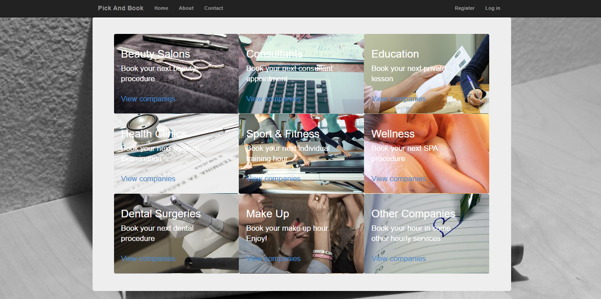
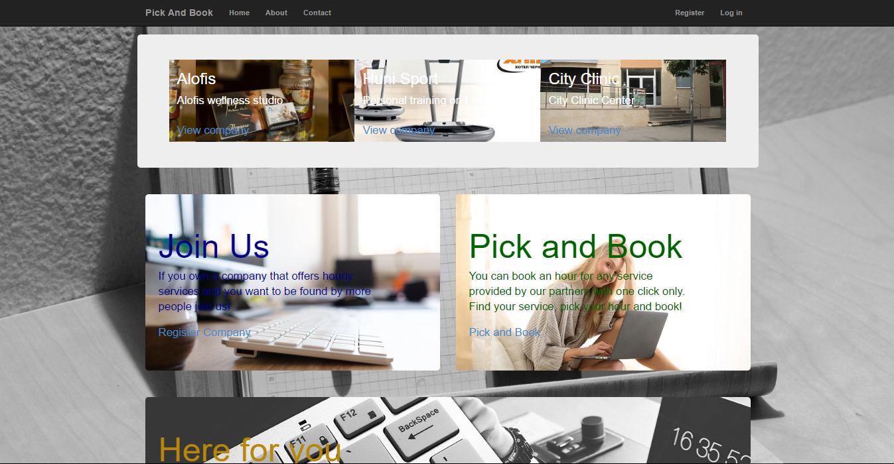
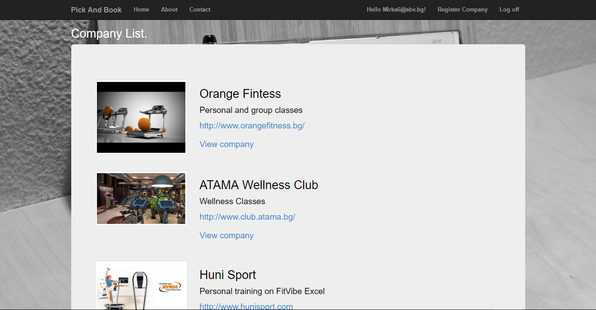
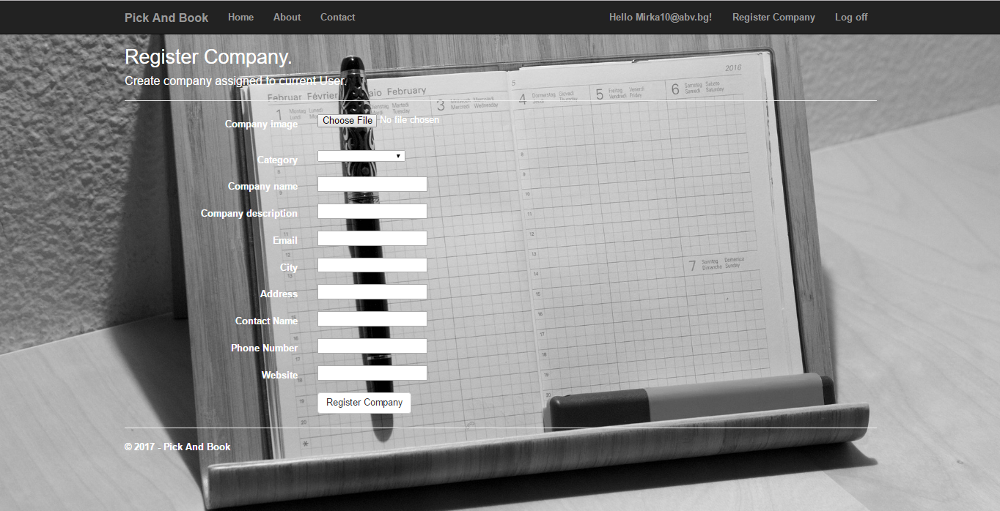
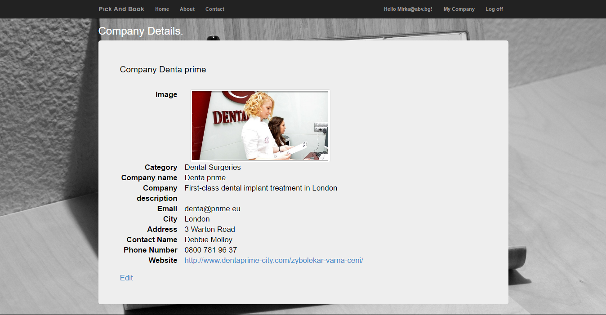
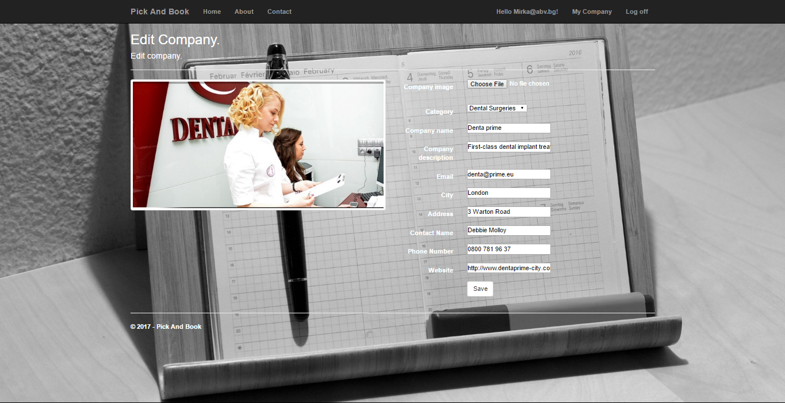
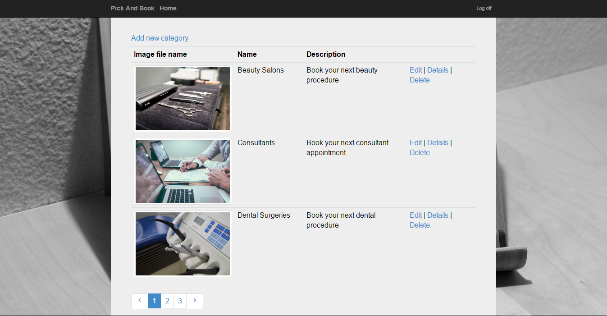
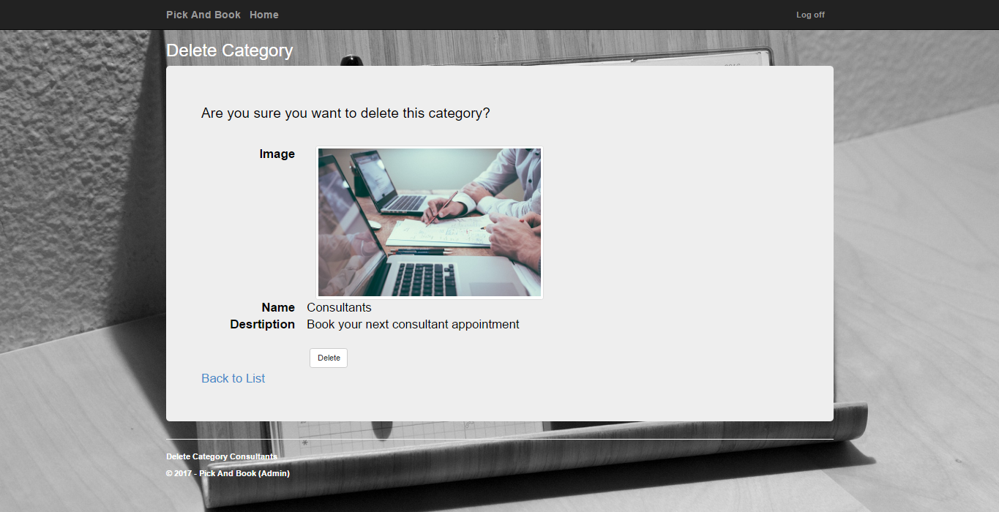

**Pick and Book**

The idea of the application is to allow users to book a visit in a Company. The companies are divided in Categories managed by the Administrator. Each company should provide a schedule (booked / available) hours. Each Client can see it, search a company who can provide the service he needs and book an hour in appropriate time. The system can be enhanced in many directions, like adding some kind of reports, history, promotions, payments, and others ... 

**What is done so far:**
- Categories - add, edit, delete from Admin user
- Register Company from Clien user
- Edit Company from Company user
- See Categories, List of Companies, Company's detailed information by all users 

**Administration Part**

The administration part is accessible for users with 'Admin' role assigned. The Admin can edit, add and delete Categories.

**Public Part**

Non - registered users can see all Categories, Companies and detailed information for the Company. 

**Private Part (Users only)**

Registered Users can have one of the two roles: Client or Company. To all newly registered users is assigned automatically 'Client' role. If the user registers his own company, he receives role 'Company' and is no more 'Client'.
Company information can be edited only by 'Company' user who has register the company.
The idea of these two roles is to have different functionality in the system in the future implementation.    

**Technical Part**

- The application is developed using ASP.NET MVC. 
- Entity Framework 6 is used to relate to a SQL Server database. 
- Repositories are used. 
- The Admin part is separated in Admin area.
- Razor template engine is used to generate the UI
- Some Ajax calls in paging implementation 
- Some Cahing with SQL Dependency in start page
- SignalR with SQL Dependency in start page as well
- The standard ASP.NET Identity System is used for assigning roles to users
- Error handling on Controller level and on Http level
- The application is integrated with Jenkins

**Some Screenshots**

Public part

Client user part

Company user part

Admin user part

